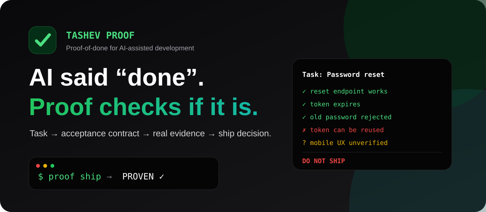
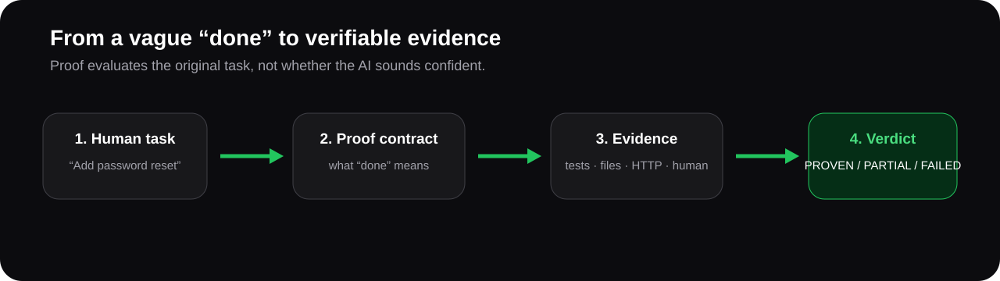
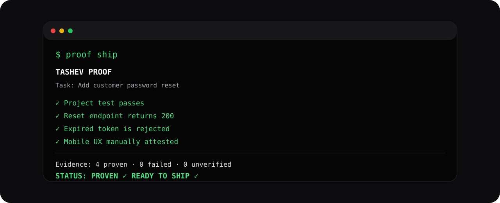
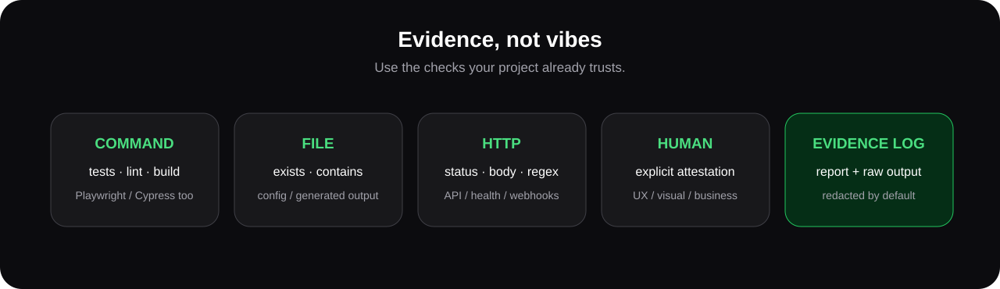
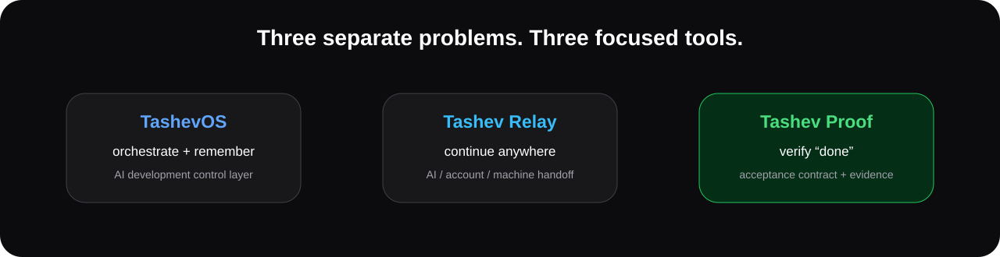

  

  
  
  
  
  

  <strong>Proof-of-done for AI-assisted development.</strong> 
  Turn a human task into an acceptance contract, execute real evidence, and decide whether it is actually ready to ship.

  <a href="#-quick-start"><strong>Quick start</strong></a> ·
  <a href="#-proof-contract"><strong>Proof contract</strong></a> ·
  <a href="#-evidence-types"><strong>Evidence</strong></a> ·
  <a href="README_RU.md"><strong>Русская версия</strong></a> ·
  <a href="https://github.com/tashev11/tashev-proof/discussions"><strong>Discussions</strong></a>

---

## The problem

AI coding agents are very good at producing code. They are not an independent source of truth about whether the original task is complete.

A typical vibe-coding loop looks like this:

~~~text
Human: Add password reset.
AI: Done ✅
Human: Did you test expired links?
AI: Fixed ✅
Human: Can the same token be reused?
AI: Fixed ✅
Human: Did mobile break?
...
~~~

The expensive part is no longer only writing code. It is knowing **what “done” means and proving it**.

Tashev Proof adds a small verification layer between “AI finished coding” and “ship it”.

  

---

## What Proof does

Proof stores an explicit acceptance contract for a task:

~~~text
TASK
Add customer password reset

DONE MEANS
✓ tests pass
✓ reset endpoint returns expected status
✓ expired tokens are rejected
✓ old password no longer works
✓ mobile UX was visually checked
~~~

Then it executes independent evidence and produces one of three verdicts:

| Verdict | Meaning |
| --- | --- |
| **PROVEN** | every required criterion has evidence |
| **PARTIAL** | nothing failed, but required evidence is still missing |
| **FAILED** | at least one required criterion failed |

It does not ask the coding agent whether its own work is correct.

---

## ⚡ Quick start

### 1. Install

From GitHub:

~~~bash
git clone https://github.com/tashev11/tashev-proof.git
cd tashev-proof
npm install -g .
proof --help
~~~

### 2. Initialize inside a project

~~~bash
cd your-project
proof init --task "Add password reset"
~~~

Proof automatically discovers common npm scripts such as:

- lint
- typecheck
- test
- build

If Tashev Relay is present, <code>proof init</code> can inherit the current Relay task automatically.

### 3. Define what “done” means

Edit:

~~~text
.proof/contract.json
~~~

Example:

~~~json
{
  "schemaVersion": 1,
  "project": "my-app",
  "task": "Add password reset",
  "criteria": [
    {
      "id": "tests",
      "title": "Authentication tests pass",
      "type": "command",
      "command": "npm test -- auth",
      "required": true
    },
    {
      "id": "health",
      "title": "Reset endpoint is reachable",
      "type": "http",
      "url": "http://localhost:3000/api/password/reset/health",
      "status": 200,
      "required": true
    },
    {
      "id": "mobile-ux",
      "title": "Mobile reset flow was visually checked",
      "type": "manual",
      "required": true
    }
  ]
}
~~~

### 4. Run proof

~~~bash
proof run
~~~

  

### 5. Add human evidence when automation cannot prove something

~~~bash
proof attest mobile-ux \
  --note "Checked reset flow at 390px viewport" \
  --by "Rinat"
~~~

Re-run:

~~~bash
proof ship
~~~

<code>proof ship</code> exits non-zero unless the verdict is **PROVEN**, so it can also act as a CI/release gate.

---

## 🧾 Proof contract

The contract is the important part of the product.

It answers:

> What must be true before this human task can honestly be called complete?

A criterion can also describe which files it is related to:

~~~json
{
  "id": "auth-tests",
  "title": "Auth regression tests pass",
  "type": "command",
  "command": "npm test -- auth",
  "required": true,
  "files": [
    "src/auth/**",
    "src/session/**"
  ]
}
~~~

Then:

~~~bash
proof run --since HEAD~3
~~~

uses Git changes to select impacted criteria. Criteria without a file mapping remain conservative and still run.

---

## 🔬 Evidence types

  

### Command

Use anything your project already trusts:

~~~json
{
  "id": "e2e",
  "title": "Checkout browser flow passes",
  "type": "command",
  "command": "npx playwright test checkout.spec.ts"
}
~~~

This means Proof works with Playwright, Cypress, pytest, Jest, Vitest, Go tests, shell scripts, security scanners and existing project tooling without trying to replace them.

### File exists

~~~json
{
  "id": "migration",
  "title": "Database migration was generated",
  "type": "file_exists",
  "path": "migrations/2026_add_reset_token.sql"
}
~~~

### File contains

~~~json
{
  "id": "config",
  "title": "Reset route is registered",
  "type": "file_contains",
  "path": "src/routes.js",
  "contains": "/password/reset"
}
~~~

Regular expressions are supported through <code>regex</code> and <code>flags</code>.

### HTTP

~~~json
{
  "id": "api",
  "title": "Production health endpoint is healthy",
  "type": "http",
  "url": "https://example.com/health",
  "status": 200,
  "contains": "\"ok\":true"
}
~~~

Secrets do not need to be committed into the contract:

~~~json
{
  "headers": {
    "Authorization": "Bearer {{env.PROOF_API_TOKEN}}"
  }
}
~~~

### Manual

Some facts are genuinely human:

- visual polish;
- business approval;
- wording;
- physical-device behavior;
- legal/content review.

Proof does not fake automation for those.

~~~bash
proof attest mobile-ux --note "Checked on real iPhone"
~~~

Human evidence is explicit and revocable:

~~~bash
proof revoke mobile-ux
~~~

---

## 📊 Evidence and reports

Every run writes:

~~~text
.proof/
├── contract.json          # acceptance contract; commit this
├── attestations.json      # local human evidence; ignored
├── latest.json            # last run; ignored
├── evidence/
│   └── <run-id>/
│       ├── tests.txt
│       ├── api.txt
│       └── mobile-ux.txt
└── reports/
    └── <run-id>.md
~~~

Raw command / HTTP evidence is captured and common credential patterns are redacted.

---

## 🧠 Tashev Relay integration

Proof works alone.

If <code>.relay/state.json</code> exists, <code>proof init</code> can use Relay's current task instead of making you type it again.

That gives a clean workflow:

~~~text
Tashev Relay
“Here is where the work stopped.”
        ↓
Tashev Proof
“Here is what must be proven before it ships.”
~~~

  

The tools remain separate on purpose.

---

## Why this is not another test framework

Proof does not compete with your test runner.

A test framework answers:

> Did this test pass?

Proof answers:

> Does the evidence we have prove the original task is complete?

It can orchestrate your existing:

- unit tests;
- integration tests;
- browser tests;
- API checks;
- file/build assertions;
- security tools;
- human approvals.

The contract connects those pieces to the **human requirement**.

---

## 📦 CLI

| Command | Purpose |
| --- | --- |
| <code>proof init</code> | create an acceptance contract and discover baseline checks |
| <code>proof plan</code> | inspect and validate the contract |
| <code>proof run</code> | execute selected evidence |
| <code>proof run --since REF</code> | run criteria impacted by Git changes |
| <code>proof run --only id1,id2</code> | run selected criteria |
| <code>proof attest ID</code> | add explicit human evidence |
| <code>proof revoke ID</code> | revoke human evidence |
| <code>proof status</code> | inspect the latest verdict |
| <code>proof ship</code> | release gate: succeeds only when PROVEN |

---

## 🔐 Security model

A Proof contract can contain command checks. That means:

> **Do not run Proof contracts from untrusted repositories without reviewing them first.**

This is the same trust boundary as running npm scripts, Makefiles or project test commands.

Other defaults:

- runtime evidence is ignored by Git;
- common token/password patterns are redacted from captured evidence;
- HTTP secrets can come from environment placeholders;
- Proof does not read AI authentication files;
- Proof does not require a cloud account;
- Proof does not upload evidence anywhere.

Read [SECURITY.md](SECURITY.md).

---

## 🌱 Roadmap

### v0.1
- [x] acceptance contracts
- [x] command evidence
- [x] file evidence
- [x] HTTP evidence
- [x] human attestations
- [x] evidence reports
- [x] secret redaction
- [x] Git impact filtering
- [x] Tashev Relay task handoff
- [x] CI/release exit codes

### Next
- [ ] browser evidence adapter with screenshots
- [ ] automatic acceptance-criteria suggestions
- [ ] Claude Code / Codex task adapters
- [ ] signed team attestations
- [ ] GitHub PR proof report
- [ ] reusable policy packs
- [ ] proof history and regression trends
- [ ] MCP server
- [ ] machine-readable SARIF / JUnit output

See [ROADMAP.md](ROADMAP.md).

---

## 🧩 Contributing

The most useful contributions are new evidence adapters and real-world acceptance-contract examples.

See [CONTRIBUTING.md](CONTRIBUTING.md).

---

## ⭐ The idea in one line

> **AI can write the implementation. Proof decides whether you have enough evidence to call the task done.**

If this problem is familiar, star the repository and bring a real task that an AI claimed was finished.

  <a href="https://github.com/tashev11/tashev-proof"><strong>⭐ Star Tashev Proof</strong></a>
  &nbsp; · &nbsp;
  <a href="https://github.com/tashev11/tashev-proof/discussions"><strong>💬 Discussions</strong></a>
  &nbsp; · &nbsp;
  <a href="https://github.com/tashev11/tashev-proof/issues/new/choose"><strong>🧩 Contribute</strong></a>

---

## License

MIT © 2026 Rinat Tashev.

  Built by <a href="https://github.com/tashev11"><strong>@tashev11</strong></a> 
  <em>Don't trust “done”. Prove it.</em>

