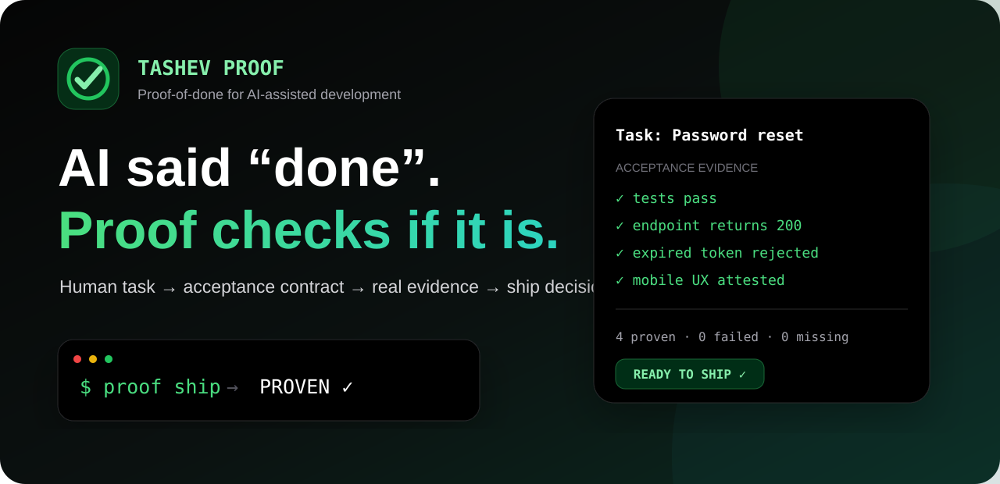
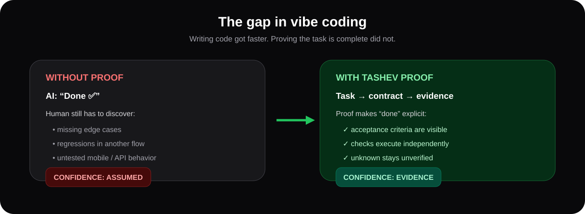
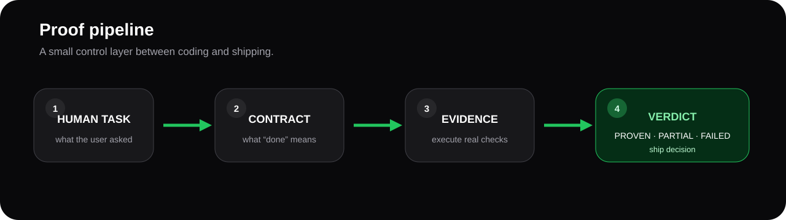
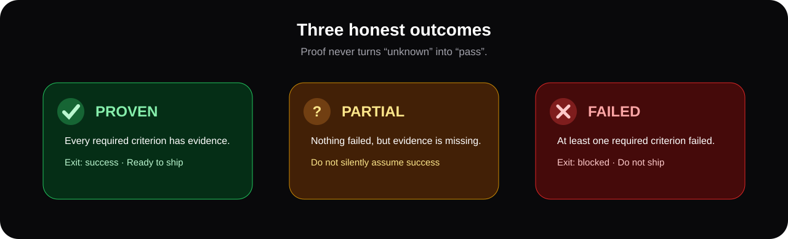
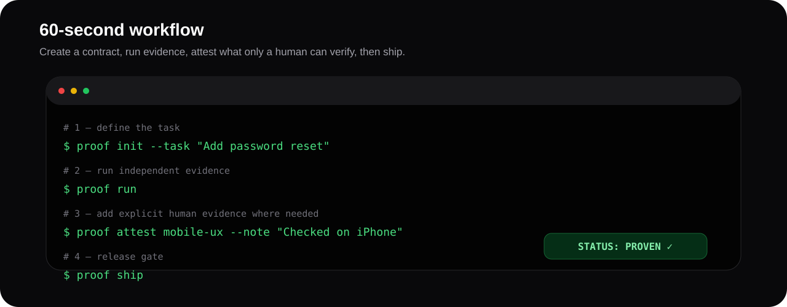
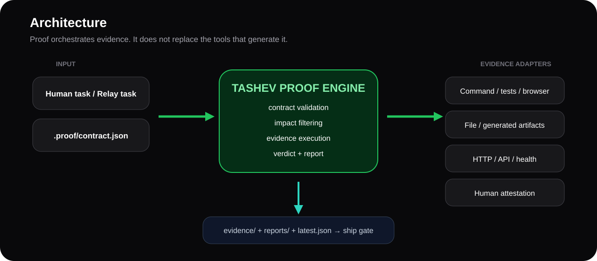
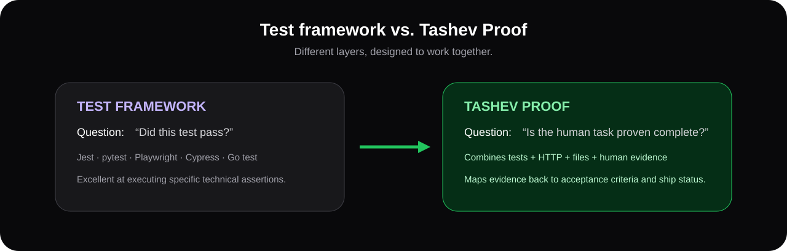

<p align="center">
  
</p>

<p align="center">
  <a href="https://github.com/tashev11/tashev-proof/releases/latest"></a>
  <a href="LICENSE"></a>
  
  <a href="https://github.com/tashev11/tashev-proof/stargazers"></a>
</p>

# Tashev Proof — русская версия

> **AI сказал «готово». Proof проверяет, так ли это.**

Tashev Proof — local-first система **proof-of-done** для AI-разработки.

Она ставится между двумя событиями:

```text
AI закончил писать код
        ↓
Tashev Proof
        ↓
можно / нельзя выпускать
```

Proof не спрашивает у того же AI: «ты точно всё сделал?».

Он берёт исходную человеческую задачу, явные критерии готовности и собирает реальные доказательства.

---

# 🎯 Какую боль это закрывает

Вайбкодинг сильно ускорил написание кода.

Но после сообщения:

> Готово ✅

обычно начинается вторая работа:

- проверить, не забыты ли edge cases;
- понять, не сломалась ли другая функция;
- открыть мобильную версию;
- проверить API;
- убедиться, что build/test вообще запускались;
- вспомнить, что именно было обещано в исходной задаче;
- попросить AI «перепроверить всё»;
- после релиза найти то, что никто не проверил.

<p align="center">
  
</p>

**Proof превращает уверенность в доказательства.**

Без Proof:

```text
AI: всё готово
↓
кажется, можно выпускать
```

С Proof:

```text
задача
↓
критерии готовности
↓
реальные проверки
↓
PROVEN / PARTIAL / FAILED
```

---

# 🧩 Главная идея

<p align="center">
  
</p>

У любой задачи появляются четыре слоя.

## 1. Человеческая задача

Например:

```text
Добавить восстановление пароля.
```

## 2. Acceptance contract

Что должно быть правдой, чтобы задачу действительно считать выполненной:

```text
✓ тесты авторизации проходят
✓ endpoint восстановления работает
✓ просроченный token отклоняется
✓ старый пароль больше не подходит
✓ мобильный сценарий проверен
```

## 3. Evidence

Proof запускает реальные проверки:

- tests;
- lint;
- build;
- Playwright/Cypress;
- HTTP;
- проверку файлов;
- ручную приёмку.

## 4. Verdict

Proof выдаёт итог:

- **PROVEN**
- **PARTIAL**
- **FAILED**

---

# ✅ Три честных результата

<p align="center">
  
</p>

| Статус | Что означает |
| --- | --- |
| **PROVEN** | все обязательные критерии подтверждены |
| **PARTIAL** | ошибок нет, но обязательных доказательств не хватает |
| **FAILED** | хотя бы один обязательный критерий провалился |

Главный принцип:

> **Если мы чего-то не проверили — это не считается успехом.**

Proof не превращает неизвестность в зелёную галочку.

---

# 👤 Кому это нужно

## Вайбкодерам

Если приложение собирается через Claude Code, Codex, Cursor, Gemini или другой AI, Proof помогает понять, что именно реально готово.

## Владельцам продуктов

Не обязательно разбираться в каждом тесте. Важнее видеть:

> выполнена ли исходная задача и чем это подтверждено.

## Solo-разработчикам

Можно превратить личный чек-лист перед релизом в повторяемый contract.

## Небольшим AI-командам

Несколько людей и AI могут работать параллельно, а определение «готово» остаётся единым.

## Проектам с большим количеством AI-generated code

Чем быстрее генерируется код, тем нужнее отдельный слой приёмки.

---

# ⚡ Быстрый старт

<p align="center">
  
</p>

## Установка

Из текущего GitHub Release:

```bash
npm install -g https://github.com/tashev11/tashev-proof/releases/download/v0.1.0/tashev-proof-0.1.0.tgz
```

Или из исходников:

```bash
git clone https://github.com/tashev11/tashev-proof.git
cd tashev-proof
npm install -g .
```

Проверка:

```bash
proof --help
```

## Создаём задачу

В любом проекте:

```bash
proof init --task "Добавить восстановление пароля"
```

Появится:

```text
.proof/
├── contract.json
└── README.md
```

Proof также автоматически находит стандартные npm-команды:

- lint;
- typecheck;
- test;
- build.

Если в проекте установлен Tashev Relay, текущая задача может быть подхвачена оттуда автоматически.

---

# 🧾 Как выглядит Proof Contract

```json
{
  "schemaVersion": 1,
  "project": "my-app",
  "task": "Добавить восстановление пароля",
  "criteria": [
    {
      "id": "auth-tests",
      "title": "Тесты авторизации проходят",
      "type": "command",
      "command": "npm test -- auth",
      "required": true
    },
    {
      "id": "reset-api",
      "title": "Reset endpoint отвечает корректно",
      "type": "http",
      "url": "http://localhost:3000/api/password/reset/health",
      "status": 200,
      "required": true
    },
    {
      "id": "mobile-ux",
      "title": "Мобильный сценарий проверен визуально",
      "type": "manual",
      "required": true
    }
  ]
}
```

Запуск:

```bash
proof run
```

Если осталась ручная проверка:

```bash
proof attest mobile-ux \
  --note "Проверил полный сценарий на ширине 390px" \
  --by "Ринат"
```

После этого:

```bash
proof ship
```

Если всё подтверждено:

```text
Evidence: 3 proven · 0 failed · 0 unverified
STATUS: PROVEN ✓

READY TO SHIP ✓
```

---

# 🔬 Какие доказательства поддерживаются

<p align="center">
  
</p>

## Command

Любая существующая команда проекта:

```json
{
  "id": "e2e",
  "title": "Browser flow проходит",
  "type": "command",
  "command": "npx playwright test checkout.spec.ts"
}
```

Можно использовать:

- Jest;
- Vitest;
- pytest;
- Playwright;
- Cypress;
- Go test;
- lint;
- typecheck;
- build;
- security scanner;
- собственные shell scripts.

Proof не пытается заменить эти инструменты.

Он объединяет результаты вокруг человеческой задачи.

## File exists

```json
{
  "id": "migration",
  "title": "Миграция создана",
  "type": "file_exists",
  "path": "migrations/2026_add_reset_token.sql"
}
```

## File contains

```json
{
  "id": "route",
  "title": "Route зарегистрирован",
  "type": "file_contains",
  "path": "src/routes.js",
  "contains": "/password/reset"
}
```

Поддерживаются и регулярные выражения.

## HTTP

```json
{
  "id": "health",
  "title": "Production API здоров",
  "type": "http",
  "url": "https://example.com/health",
  "status": 200,
  "contains": "\"ok\":true"
}
```

Секрет не нужно хранить в contract:

```json
{
  "headers": {
    "Authorization": "Bearer {{env.PROOF_API_TOKEN}}"
  }
}
```

## Manual

То, что машина не должна притворяться способной оценить:

- визуал;
- UX;
- текст;
- бизнес-приёмка;
- поведение на физическом устройстве;
- юридическая проверка;
- субъективное качество.

```bash
proof attest mobile-ux \
  --note "Проверено на реальном iPhone" \
  --by "Product owner"
```

Подтверждение можно отозвать:

```bash
proof revoke mobile-ux
```

---

# 🧠 Архитектура

<p align="center">
  
</p>

Proof состоит из четырёх частей.

### Input

Исходная задача пользователя или текущая задача из Tashev Relay.

### Contract

`.proof/contract.json` — что именно считается готовым.

### Evidence adapters

Команды, файлы, HTTP и человеческая приёмка.

### Verdict

Итоговый статус + отчёт + exit code.

Рабочие данные:

```text
.proof/
├── contract.json
├── attestations.json
├── latest.json
├── evidence/
│   └── <run-id>/
└── reports/
    └── <run-id>.md
```

Contract предназначен для хранения вместе с проектом.

Runtime evidence по умолчанию игнорируется Git.

---

# 🧪 Чем Proof отличается от обычного тестировщика

<p align="center">
  
</p>

Обычный test framework отвечает:

> этот конкретный тест прошёл?

Proof отвечает:

> достаточно ли доказательств, чтобы считать **исходную человеческую задачу** выполненной?

Это разные уровни.

Можно иметь полностью зелёные unit tests, но всё равно не выполнить задачу, если:

- не подключён route;
- не проверен mobile;
- забыто бизнес-правило;
- не проверен production endpoint;
- пользовательский сценарий не совпадает с ожиданием.

Proof располагается **над** отдельными тестами.

---

# 🔁 Проверять только затронутое

Критерий можно связать с файлами:

```json
{
  "id": "auth-regression",
  "title": "Auth regression проходит",
  "type": "command",
  "command": "npm test -- auth",
  "files": [
    "src/auth/**",
    "src/session/**"
  ]
}
```

После изменений:

```bash
proof run --since HEAD~3
```

Proof использует Git diff и выбирает связанные проверки.

Если у критерия нет file mapping, он остаётся консервативным и запускается.

---

# 🚦 Release Gate

```bash
proof ship
```

Логика:

- **PROVEN** → exit code 0;
- **PARTIAL** → выпуск блокируется;
- **FAILED** → выпуск блокируется.

Поэтому Proof можно использовать в CI.

Пример:

```yaml
- name: Install Tashev Proof
  run: npm install -g https://github.com/tashev11/tashev-proof/releases/download/v0.1.0/tashev-proof-0.1.0.tgz

- name: Verify release
  run: proof ship
```

Один и тот же contract работает локально и перед релизом.

---

# 📊 Отчёты

Каждый запуск создаёт Markdown report.

Например:

```text
Task: Добавить восстановление пароля
Verdict: PROVEN

✅ auth tests
✅ reset API
✅ expired token rejected
✅ mobile UX attested

Commit: 9fa31b2c
```

Кроме отчёта сохраняется raw evidence.

Сам **Tashev Proof v0.1.0 был выпущен только после того, как Proof проверил собственный релиз**.

К GitHub Release приложен настоящий:

```text
PROOF-v0.1.0.md
```

Результат:

```text
8 proven
0 failed
0 unverified

PROVEN ✓
```

---

# 🔐 Безопасность

Proof — local-first.

Он не требует отдельного облачного аккаунта и не должен собирать секреты.

Proof не читает специально:

- файлы авторизации AI;
- cookies;
- private SSH keys;
- `.env`.

HTTP secrets можно брать из environment.

Common token/password patterns редактируются в evidence.

## Важная граница доверия

`.proof/contract.json` может содержать command criteria.

Поэтому чужой непроверенный contract нужно читать перед запуском так же, как:

- package.json scripts;
- Makefile;
- GitHub Actions workflow;
- shell script.

Подробнее: [SECURITY.md](SECURITY.md).

---

# 🔗 Связка с Tashev Relay

Proof работает полностью самостоятельно.

Но если есть Tashev Relay:

```text
Relay:
где мы остановились?
       ↓
Proof:
что нужно доказать перед выпуском?
```

<p align="center">
  
</p>

Логика линейки:

- **TashevOS** — управляет и помнит AI-разработку;
- **Tashev Relay** — переносит работу между AI и компьютерами;
- **Tashev Proof** — независимо проверяет «готово».

---

# 💡 Примеры реальных задач

## Авторизация

Задача:

```text
Добавить восстановление пароля.
```

Proof может требовать:

- auth tests;
- reset endpoint;
- истечение token;
- запрет повторного использования token;
- старый пароль перестал работать;
- mobile UX проверен.

## Платежи

Задача:

```text
Защитить webhook от повторного начисления.
```

Proof может требовать:

- idempotency tests;
- проверку БД;
- HTTP webhook;
- retry path;
- failed-event path.

## Лендинг

Задача:

```text
Переделать блок тарифов под мобильный.
```

Proof может требовать:

- build;
- Playwright scenario;
- отсутствие console errors;
- mobile attestation;
- утверждение текста.

## Production hotfix

Задача:

```text
Исправить 500 при экспорте клиентов.
```

Proof может требовать:

- regression test;
- наличие export file;
- production health;
- ручную проверку файла;
- только затронутые проверки через `--since`.

---

# 🛠 Команды

| Команда | Назначение |
| --- | --- |
| `proof init --task "..."` | создать contract |
| `proof plan` | проверить contract |
| `proof contract` | показать contract |
| `proof run` | выполнить evidence |
| `proof run --only id1,id2` | выполнить выбранные критерии |
| `proof run --since REF` | проверить затронутые изменения |
| `proof attest ID --note "..."` | добавить human evidence |
| `proof revoke ID` | отозвать human evidence |
| `proof status` | последний verdict |
| `proof ship` | разрешить выпуск только при PROVEN |
| `proof version` | версия |

---

# 🧭 Принципы проекта

**Evidence over confidence**
Заявление AI не является доказательством.

**Unknown stays unknown**
Не проверено ≠ прошло.

**Reuse existing tools**
Proof не заменяет Jest, pytest или Playwright.

**Human approval stays visible**
Ручная приёмка остаётся явной.

**Local-first**
Core не требует облака.

**Agent-neutral**
Любой AI может писать код. Proof остаётся независимым слоем.

**Small core**
Система должна оставаться понятной.

---

# 🌱 Roadmap

## Уже есть

- [x] acceptance contracts
- [x] command evidence
- [x] file evidence
- [x] HTTP evidence
- [x] human attestations
- [x] PROVEN / PARTIAL / FAILED
- [x] reports
- [x] secret redaction
- [x] Git impact filtering
- [x] Relay integration
- [x] ship gate
- [x] zero runtime dependencies

## Следующие шаги

- [ ] Playwright adapter
- [ ] screenshots/video/trace evidence
- [ ] GitHub PR report
- [ ] JUnit/SARIF
- [ ] reusable policy packs
- [ ] optional AI suggestions для acceptance criteria
- [ ] Claude/Codex/Cursor/Gemini adapters
- [ ] signed team attestations
- [ ] history / regression trends
- [ ] MCP server

---

# 🎨 Набор визуальных материалов

В репозитории есть готовый визуальный набор для README, лендинга, постов и презентаций.

<p align="center">
  
  &nbsp;&nbsp;
  
  &nbsp;&nbsp;
  
  &nbsp;&nbsp;
  
  &nbsp;&nbsp;&nbsp;&nbsp;
  
  &nbsp;&nbsp;
  
  &nbsp;&nbsp;
  
</p>

В набор входят hero, social preview, схемы проблемы/решения, pipeline, архитектура, сравнение с тестами, quick-start иконки и статусы.

Подробнее: [docs/BRANDING.md](docs/BRANDING.md).

---

# ❓ FAQ

### Proof сам использует AI?

Core v0.1 — нет. Он выполняет явные проверки. В будущем AI может предлагать draft критериев, но не должен сам объявлять их достаточными.

### Это замена Playwright/Jest/pytest?

Нет. Proof использует их как evidence.

### Код отправляется в облако?

Core этого не требует.

### Что делать, если критерий нельзя автоматизировать?

Использовать `manual` + `proof attest`.

### Можно использовать в CI?

Да. `proof ship` блокирует выпуск, если итог не PROVEN.

### Relay обязателен?

Нет. Интеграция опциональна.

### Зачем, если можно написать AI «проверь всё»?

Потому что это всё ещё тот же агент, оценивающий собственную работу. Proof создаёт отдельный явный contract и повторяемые evidence checks.

---

# ⭐ Если вам знакома эта ситуация

> AI сказал «готово», а следующие полчаса вы выясняете, что именно он не доделал.

Тогда Tashev Proof сделан именно для этого.

<p align="center">
  <a href="https://github.com/tashev11/tashev-proof/stargazers"><strong>⭐ Поставить звезду</strong></a>
  &nbsp;&nbsp;·&nbsp;&nbsp;
  <a href="https://github.com/tashev11/tashev-proof/discussions"><strong>💬 Discussions</strong></a>
  &nbsp;&nbsp;·&nbsp;&nbsp;
  <a href="https://github.com/tashev11/tashev-proof/issues/new/choose"><strong>🧩 Внести вклад</strong></a>
</p>

---

MIT © 2026 Rinat Tashev.

<p align="center">
  <strong>Don't trust “done”. Prove it.</strong>
</p>
